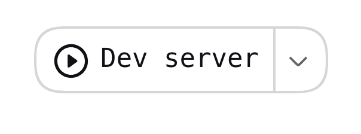
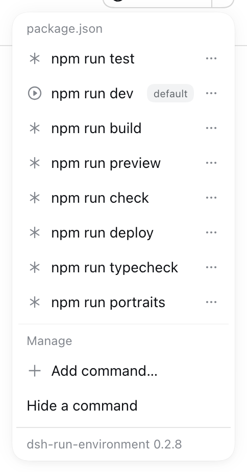
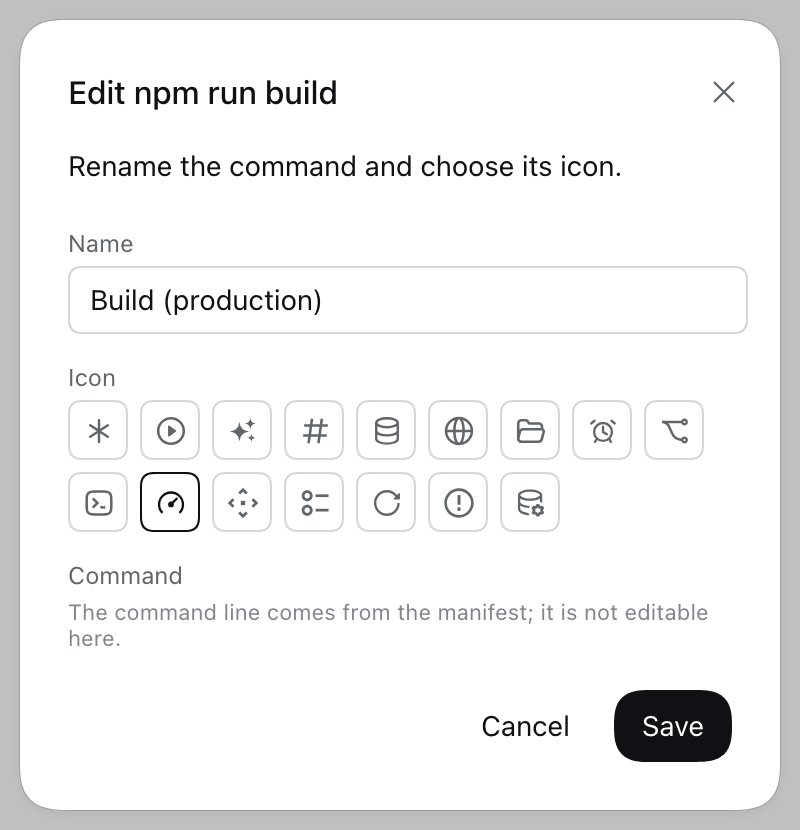
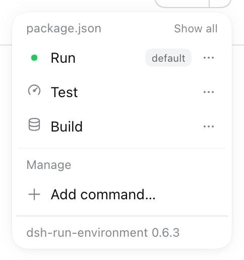
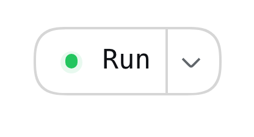
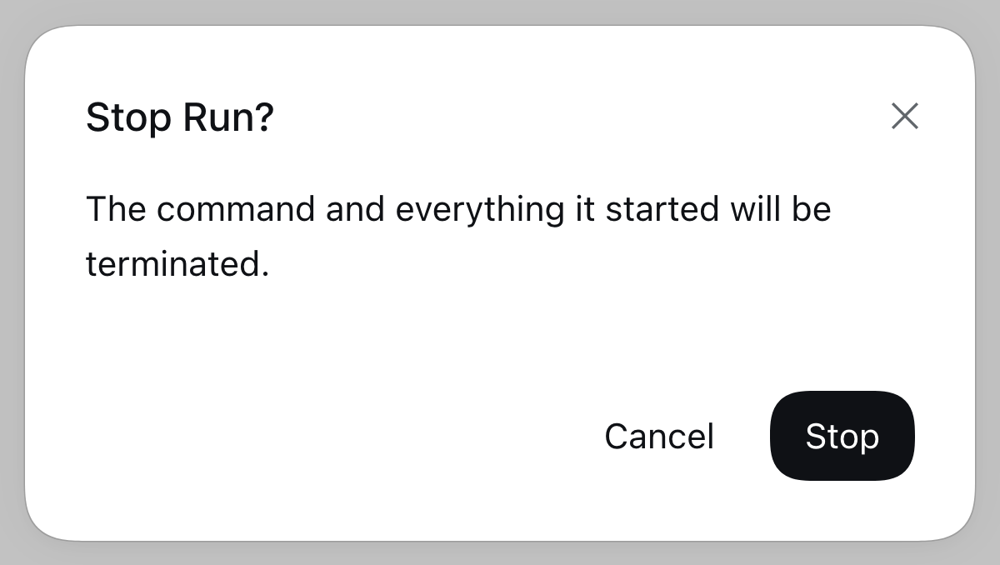
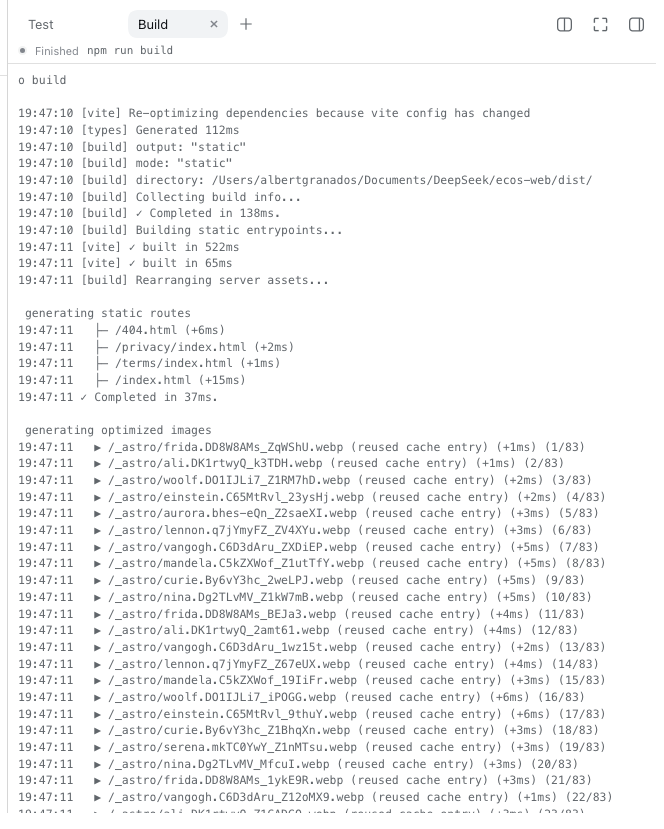
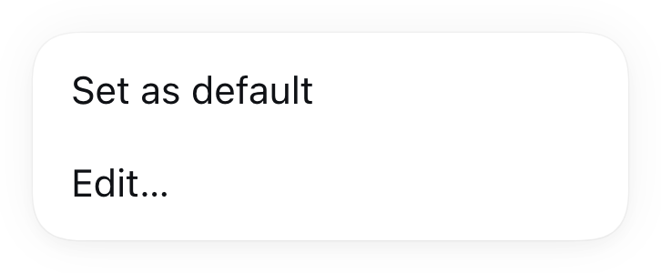
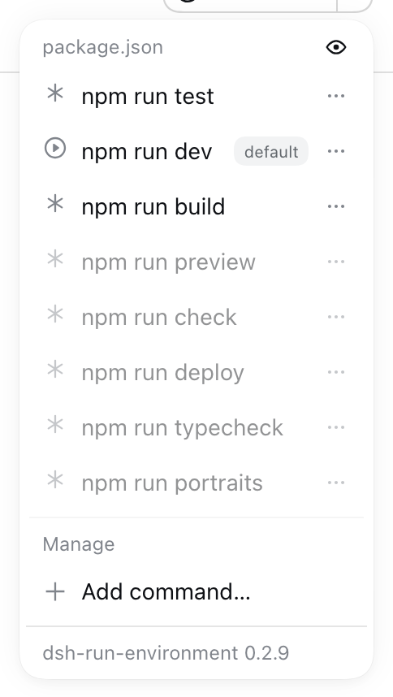

# dsh-run-environment

[](https://github.com/albertgranados/dsh-run-environment/actions/workflows/ci.yml)
[](LICENSE)
[](package.json)
[](package.json)

**Run the project you have open, from the harness you are already in.**

A [DeepSeek Harness](https://github.com/deepseek-ai/deepseek-harness) plugin that adds one control to
the Session header: it detects how the current workspace is meant to be run and runs it, without
leaving the conversation.



Node.js projects are detected today (`package.json` scripts, ranked so the play button lands on
`dev`). Everything else is a first-class citizen through user-defined commands, and adapters for
other environments are the project's main axis of growth — the header asks the project, not npm.



Every row carries its icon and its own options; **Edit…** renames a command and picks a different
glyph, without touching the manifest:



---

## Features

- **Detection, not configuration.** A `package.json` with scripts is enough: no manifest to write, no
  path to teach the plugin. Detection is adapter-based, so other environments plug into the same
  model, and the menu groups commands by the file that declared them (`package.json`, `Makefile`, …).
- **Rename them, describe them, give them icons.** Every row carries an icon — a neutral asterisk
  until you pick another — and its own options: **Set as default**, **Edit** (rename it, choose a
  glyph, write an optional description) and, for a command you defined yourself, **Delete**.
- **A play button that means something.** The default is `dev`, then `start`, then whatever the
  manifest declares first — ranked by the adapter, resolved on the host.
- **Run and stop.** While a command is alive the button turns into a stop button, and stopping
  terminates the whole process group (`npm → sh → the dev server`), not just the parent — after asking
  you first.
- **You can see what is running.** A live command's row swaps its icon for the harness's green status
  dot, wherever it sits in the list — including commands that are not the default. Pressing that row
  asks before stopping it, so a stray click cannot kill a dev server mid-thought.
- **Every run gets a console.** Launching a command opens its output in the harness's own right
  Sidebar: one tab per command, live, with the run's state and a way to stop it. It needs no extra
  plugin — it rides the Sidebar's public tab API, and a client without that Sidebar simply runs
  commands as it always did.



The same dot replaces the header button's play icon while the default command is alive:



Pressing that row asks before it stops:


- **Any command, any environment.** Add your own commands from the menu (`docker compose up -d`,
  `python manage.py runserver`, …). They run in the project directory through your shell.
- **Quiet by default.** Commands you never run can be hidden; hidden ones stay restorable and always
  sort to the bottom. A workspace with nothing detected and nothing configured renders nothing at all.
- **Put them in the order you want.** Drag a row to move it and the order is remembered per project.
  The default is always the first row of its section, so the thing the play button runs is always
  where you look first.
- **Failures surfaced where you are looking.** A command that dies right after launch paints the
  control red and carries its last output line in the tooltip.
- **Zero runtime dependencies.** The host half imports nothing but Node built-ins and the harness's
  own packages; the browser half is served verbatim by the harness, so installing from git costs one
  command and no build step. 72 tests run offline with `node --test`.

## Install

```sh
# from GitHub
dsh plugin --profile web add github:albertgranados/dsh-run-environment

# or from a local checkout (copies the package into the profile)
dsh plugin --profile web add "file:$PWD"
```

Then restart the harness and reload the browser page. The plugin declares `dsh.bundle.patch`, so
`dsh plugin` reconciles `dsh.profile.bundles` itself — no profile file to edit by hand.

Uninstall with `dsh plugin --profile web remove dsh-run-environment`.

## The run console



Running a command reveals the right Sidebar on a tab named after that command. Its bar carries the same
status dot the menu uses, the command line, and a **Stop** button that asks before it kills anything;
the body streams the run's output while it is alive and keeps it afterwards, with the exit state
reading as *Finished*, *Stopped* or *Failed*.

Each command keeps its own tab: running a second command opens a second console instead of replacing
the first, and running one again focuses the console it already has. The tabs belong to the session, so
each conversation shows its own.

A console keeps reading the host, and it reads whatever the host can answer: a build older than the
console serves the same tail as plain text, and the console takes it rather than turning a version
mismatch into an error. It stays honest about what it is showing. If the harness restarts
underneath it — which forgets every run — the tab says the run is no longer known instead of pretending,
and if a read fails it names what failed (the host answering, or the host being unreachable) and retries
without losing the output already on screen. Whenever the command is not running, the bar offers **Run
again**, so a console whose run is gone is a way back rather than a dead end.

## Managing what is in the menu

Each row's three-dot handle opens that row's options on top of the list, which stays open behind
them:



- **Set as default** moves the play button onto that command. Running a command from the menu also
  makes it the default, so the button follows the last thing you picked.
- **Edit** renames the command, chooses its icon, and writes an optional **description** that appears
  when you hover the row. The command line itself is shown locked: a detected command's belongs to its
  manifest, and a user-defined one *is* the command — renaming it should never silently change what
  runs.
- **Hide** takes a detected command out of the menu, and **Unhide** puts it back. Only commands that
  belong to a manifest offer it; a command you defined is deleted instead.
- **Drag a row** to move it. The order is remembered per project; the default stays first and hidden
  commands stay last, so what you can run is never mixed with what you cannot.
- A row whose command is **alive** wears the green status dot instead of its icon. Pressing that row,
  the dot, or the header button all open the same confirmation, and only **Stop** ends the process.
- **Show all** at the right of a section heading reveals that section's hidden commands, dimmed, so
  they can be taken back out of hiding without leaving the menu. **Show less** hides them again.



## How it works

```
Session header
   └── /run-environment/*  ──►  router ──► adapters (detect)
                                    │        project store (remember)
                                    └──────► runner (spawn, stop, observe)
```

The host owns the model; the browser half only renders it and posts back a command **id** — never a
program name. Every route sits behind the harness's own Host/Origin fence and login cookie.

| Route | Purpose |
| --- | --- |
| `GET /run-environment/commands?cwd=<abs>` | Detected and user-defined commands, the resolved default, and the live run table. |
| `POST /run-environment/run` | `{ cwd, id }` → start that command (and remember it as the default). |
| `POST /run-environment/stop` | `{ cwd, id }` → terminate that run's process group. |
| `POST /run-environment/state` | `{ cwd, action, … }` → `set-default`, `edit`, `reorder`, `hide`, `show`, `add-custom`, or `remove-custom`. |
| `GET /run-environment/log?cwd=&id=&bytes=` | Collected output tail of one run. `format=json` returns the same tail under `output`, with the run beside it. |

Design notes, the request flow, and the adapter contract live in
[docs/architecture.md](docs/architecture.md) and [docs/adapters.md](docs/adapters.md).

## Supported environments

| Environment | Status | What it detects |
| --- | --- | --- |
| Node.js · npm | **Shipped** | `package.json` scripts (`dev`, `start`, …), lifecycle companions excluded. |
| Anything else | **Today** | A user-defined command per project, from the menu. |
| Python, Make, Docker Compose, Cargo, Go, Taskfile | [Roadmap](ROADMAP.md) | One adapter each — see [docs/adapters.md](docs/adapters.md) to write one. |

## Configuration

Optional, and set in the profile's `cordis.patch.yml`:

```yaml
- id: run-environment
  config:
    visibility: auto      # auto | always | never
    maxConcurrentRuns: 8
    graceMs: 5000         # SIGTERM → SIGKILL grace for a stopped command
    shell: ''             # user commands; empty means $SHELL, then /bin/sh
```

`visibility: always` is how a directory no adapter recognises yet still gets the control (and
therefore the "Add command…" entry). The full list is in
[docs/configuration.md](docs/configuration.md).

State — the default, hidden commands, and user-defined commands — is stored per project under
`$DSH_HOME/dsh-run-environment/projects.json`, never inside your repository.

## Development

```sh
git clone https://github.com/albertgranados/dsh-run-environment
cd dsh-run-environment
npm test                 # node:test, no dependencies, ~0.2 s
scripts/dev-install.sh   # install this checkout into the web profile
```

Contributions are welcome: read [CONTRIBUTING.md](CONTRIBUTING.md) for the workflow (trunk-based,
conventional commits, tests required), [SECURITY.md](SECURITY.md) before reporting anything sensitive,
and [CODE_OF_CONDUCT.md](CODE_OF_CONDUCT.md) for what is expected of everyone here.

## License

[MIT](LICENSE) © Albert Granados
